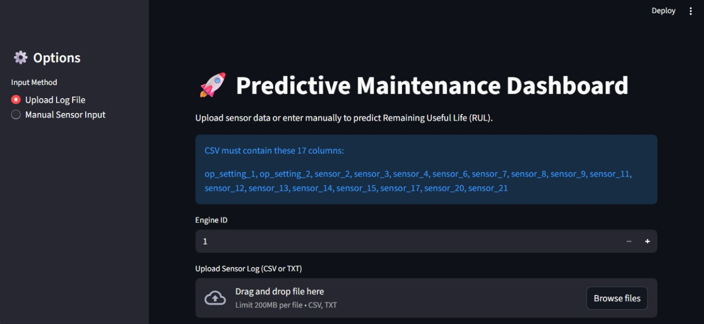

# GTC Predictive Maintenance
Machine learning project designed to predict the remaining useful life (RUL) of industrial equipment using time-series sensor data. 
The system is built on the NASA CMAPSS Turbofan Jet Engine dataset, which contains multiple operating conditions and fault modes.

---
## Dataset: NASA C-MAPSS (Commercial Modular Aero-Propulsion System Simulation)  
### Sub-datasets: FD001, FD002, FD003, FD004  
Each dataset has a different operating condition and fault mode configuration:  
  - FD001: - Conditions: ONE (Sea Level)
           - Fault Modes: ONE (HPC Degradation)
    
  - FD002: - Conditions: SIX
           - Fault Modes: ONE (HPC Degradation)
    
  - FD003: - Conditions: ONE (Sea Level)
           - Fault Modes: TWO (HPC Degradation, Fan Degradation)
      
  - FD004: - Conditions: SIX
           - Fault Modes: TWO (HPC Degradation, Fan Degradation)
  
## Our pipeline includes:

### 🔧 Data Understanding & Preprocessing: 
- Explore dataset structure and dimensions.
- Assign column names, drop empty/constant columns.
- Check missing values and duplicates and handle.
- Verify data types and correct inconsistencies.
 
### 📊 Exploratory Data Analysis (EDA): 
- Revealing the main features and distribution of the data.
- Uncover Relationships, identify correlations, and patterns between different variables.
- Detecting Outliers and unusual patterns are spotted, which can skew results if not addressed.

### 🤖 Model Training: 
- Implementing both traditional ML models (e.g., XGBoost, CatBoost, Random Forests) and deep learning approaches (e.g., LSTM ) to predict
the Remaining Useful Life (RUL) → regression framing. 

### ✅ Model Validation: 
- Performance evaluation using time-series metrics:  
  - RMSE  
  - MAE  
  - R² Score

 ### 📂 Sub-datasets Coverage:
- The pipeline was applied to **all four CMAPSS subsets (FD001–FD004)**.  
- Each subset was analyzed and modeled separately to account for unique operating conditions and fault modes.  
- Based on the comparative performance, the **most suitable model** fd001_lstm was selected and deployed in the **GTC-Predictive-Maintenance WebApp** for real-time RUL prediction.

## 🖥️ Web Application (Streamlit):
We developed a **Streamlit-based web application** for interactive RUL prediction.  
- Features:  
    - Users input sensor values  
    - The trained model (from FD001) predicts Remaining Useful Life  
    - Intuitive interface for industry stakeholders  
---
### 📈 Results & Insights:
- FD001_LSTM: Accuracy ≈ 92% (and this dataset was also used to build and deploy the web application)
- FD002_LSTM: Accuracy ≈ 78.6%
- FD003_LSTM: Accuracy ≈ 82.6%
- FD004_CatBoost: Accuracy ≈ 82.2%

👉 Overall, model accuracies ranged between 78% – 92% across the four datasets, reflecting consistent 
and reliable performance. The results demonstrate the model’s capability to make accurate predictions, with FD001 being selected 
as the primary dataset for the final web application due to its performance.

---
## 📽️ Project Presentation

You can view our full project presentation here:  
[🔗 Watch the Presentation](https://docs.google.com/presentation/d/1Z6xxRFwzu5DqX9C2cGzqd-Uw_rpPEaZxHlQNHn6Rg7Y/edit?usp=sharing)

---

## 🚀 Demo  

Here is a quick demo of our RUL prediction app built with Streamlit:



----

## 🚀 How to Run the Project

### Requirements
- Python 3.11  
- Install all required packages:
```bash
pip install -r requirements.txt
```
This will install all necessary libraries, including:
fastapi, uvicorn, streamlit, tensorflow, scikit-learn, joblib, pandas, numpy, requests.

- Running the Backend (API)
     - Open a terminal in the project directory.
     - Run the FastAPI server:
```bash
py -3.11 -m uvicorn api:app --reload --port 8000
```
The server will start at http://127.0.0.1:8000

You can test the endpoints at http://127.0.0.1:8000/docs

Keep this terminal open while running the frontend.

- Running the Frontend (Streamlit)

   - Open a new terminal in the project directory.
   - Run the Streamlit app:
```bash
py -3.11 -m streamlit run app.py
```
Open the link shown in the terminal (usually http://localhost:8501) to access the app.

#### Notes:
- Make sure the backend server is running before using the Streamlit app, otherwise the app will fail to send requests.
- The project uses pretrained models (.pkl and TensorFlow models), so ensure all model files are in the project folder.

## 📂 Project Structure:
GTC-Predictive-Maintenance/ # Repository root

- [Data/](./Data) → Raw C-MAPSS datasets (FD001–FD004)  
- [EDA/](./EDA) → Jupyter notebooks for exploratory data analysis  
- [Preprocessing/](./Preprocessing) → Data understanding & preprocessing  
- [models_building/](./models_building) → Model training notebooks  
- [models/](./models) → Saved trained models  
- [Final_code/](./Final_code) → Final integrated pipeline code  
- [Web_APP/](./Web_APP) → Streamlit web application  
- [README.md](./README.md) → Project documentation  

---

## 👩‍💻 Team Members:
- Abderlrahman Mostafa Mohamed
- Alaa Mohamed Ali 
- Aya Mohamed Abdelfatah
- Mahmoud Osama Hassan
- Maram Hazem Fouad
- Maryam Omar Ahmed
- Sara Ashraf Ragab
- Yomna Maged Ali 
